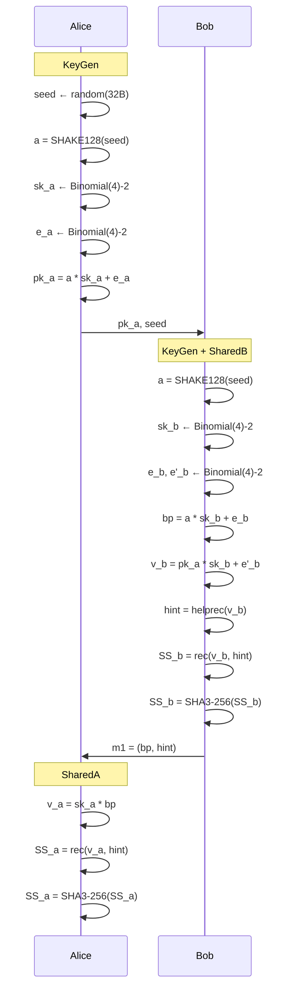

# MAMBA-NIKE Design Document

## 1. Overview

MAMBA-NIKE (**M**odular **A**rithmetic **M**ulti-**B**it **A**greement — **N**on-**I**nteractive **K**ey **E**xchange) is a lattice-based post-quantum non-interactive key exchange scheme.

**Core idea**: Replace the NewHope protocol's modulus from prime `q=12289` to a power of two (e.g., `q=2^16`), yielding:

- Modular reduction: Montgomery/Barrett → **single bitmask instruction** (`& (q-1)`)
- Polynomial multiplication: NTT (O(n log n)) → **Toom-Cook-4** (O(n^{1.404}))
- Serialization: bit-packed (7 bytes / 4 coeffs) → **16-bit direct access** (2 bytes / coeff)

## 2. Directory Structure

```
MAMBA-NIKE/
├── ref/                              # Reference implementation (default NIKE-128)
│   ├── params.h                      # Parameter definitions
│   ├── poly.h / poly.c               # Polynomial arithmetic (Toom-Cook-4 convolution)
│   ├── toom.h / toom.c               # Toom-Cook-4 multiplication kernel
│   ├── newhope.h / newhope.c         # Protocol (keygen / sharedb / shareda)
│   ├── error_correction.h / .c       # Reconciliation (helprec / rec)
│   ├── reduce.h / reduce.c           # Modular reduction (bitmask)
│   ├── fips202.h / .c                # SHAKE128 / SHA3-256
│   ├── crypto_stream_chacha20.h / .c # ChaCha20 stream cipher
│   ├── randombytes.h / .c            # /dev/urandom entropy source
│   ├── Makefile                      # Build script
│   └── test/                         # Tests (test_newhope / speed / testvectors)
│
├── API_PKC/                          # NGCC (Next-Gen Commercial Crypto) API
│   ├── Test_Vector/
│   │   └── KAT_KEX_MAMBA-NIKE.txt    # Known Answer Test vectors
│   └── Implementations/
│       ├── Reference_Implementation/
│       │   └── MAMBA-NIKE/           # Pure C reference
│       └── Optimized_Implementation/
│           └── MAMBA-NIKE/           # AVX2 ChaCha20 optimized
│               └── chacha.S          # AVX2 assembly
│
├── lattice-estimator/                # Lattice security estimator
│   └── backups/tuned_params_final.py # Tuned parameters (5 security levels)
│
├── scripts/                          # Auxiliary analysis scripts
├── NUCLEO.md                         # NUCLEO embedded platform guide
└── TESTING.md                        # Cross-platform testing guide
```

## 3. Parameter Sets

All presets share: `k = 2` (noise distribution Binomial(4)-2, range [-2, 2]), 1-pass protocol.

| Preset | Security | n | q | log₂(q) | pk bytes | m1 bytes | SS bytes | RAM (est.) |
|--------|----------|---|------|---------|----------|----------|----------|------------|
| **NIKE-128** | 128 bit | 1024 | 65536 | 16 | 2080 | 2176 | 32 | ~139 KB |
| **NIKE-192** | 192 bit | 1024 | 16384 | 14 | 2080 | 2176 | 32 | ~139 KB |
| **NIKE-256** | 256 bit | 1024 | 8192 | 13 | 2080 | 2176 | 32 | ~139 KB |
| **NIKE-384** | 384 bit | 2048 | 65536 | 16 | 4128 | 4224 | 32 | ~278 KB |
| **NIKE-512** | 512 bit | 4096 | 8192 | 13 | 8224 | 8320 | 32 | ~558 KB |

### Security Estimates (lattice-estimator)

| Preset | MATZOV | CoreSVP (classical) | CoreSVP (quantum) |
|--------|--------|---------------------|-------------------|
| NIKE-128 | 156.69 bit | 156.69 bit | 143.66 bit |
| NIKE-192 | 221.61 bit | 221.61 bit | 202.45 bit |
| NIKE-256 | 303.10 bit | 303.10 bit | 275.07 bit |
| NIKE-384 | 425.23 bit | 425.23 bit | 388.80 bit |
| NIKE-512 | 1162.60 bit | 1157.72 bit | 1110.32 bit |

### Recommended Preset: **NIKE-128**

For most applications, NIKE-128 (n=1024, q=2^16) is recommended:

1. ✅ 100% key agreement rate (verified over 50,000 runs)
2. ✅ Sufficient security margin (156.69 bit > 128 bit target)
3. ✅ Manageable memory footprint (~139 KB, suitable for most embedded platforms)
4. ✅ Moderate performance (Toom-Cook-4 ~10 ms / protocol run on Apple M-series)

## 4. Protocol Design

### 4.1 1-Pass Non-Interactive Key Exchange



### 4.2 Error Reconciliation

Uses the original NewHope **4-coefficient group Peikert reconciliation** (`f()` / `g()` / `LDDecode()`):

- Bob calls `helprec()` to generate 4×256 × 2-bit hints = **256 bytes**
- Alice calls `rec()` to recover 256-bit shared secret from `v_a` and hints
- Key change: division in `f()` and `g()` uses **shift instead of multiply-shift-correct** (since q is a power of two):
  - `x / q` → `x >> LOG2Q`
  - `x / (4*q)` → `x >> (LOG2Q + 2)`

### 4.3 Polynomial Multiplication: Toom-Cook-4

```
poly_convolution(a, b):
  1. aa[i] = a[i] (uint16_t → int64_t)
  2. prod = toom4_mul(aa, bb, n)     // full product over Z
  3. r[i] = prod[i] - prod[n + i]    // fold into x^n + 1
  4. r[i] = r[i] & (q - 1)           // mod q
```

Toom-Cook-4 splits degree-n polynomials into 4 parts, evaluates at 7 points {0, ∞, 1, -1, 2, -2, 1/2}, recursively multiplies, then interpolates via the Bodrato sequence. Cutoff threshold TOOM4_CUTOFF = 48 (below which schoolbook is used).

## 5. Build & Test

### 5.1 Reference Implementation (ref/)

```bash
cd ref
make test/test_newhope
./test/test_newhope
```

Expected output: no `ERROR keys`, 10 × `ERROR invalid sendb` (expected — tampered ciphertext must not match).

### 5.2 Switching Presets

```bash
# NIKE-128 (default)
gcc -O3 -DPARAM_N=1024 -DPARAM_Q=65536 -DLOG2Q=16 \
    crypto_stream_chacha20.c poly.c toom.c error_correction.c \
    newhope.c reduce.c fips202.c randombytes.c test/test_newhope.c \
    -o test/test_newhope

# NIKE-256
gcc -O3 -DPARAM_N=1024 -DPARAM_Q=8192 -DLOG2Q=13 \
    ... -o test/test_newhope

# NIKE-384
gcc -O3 -DPARAM_N=2048 -DPARAM_Q=65536 -DLOG2Q=16 \
    ... -o test/test_newhope

# NIKE-512
gcc -O3 -DPARAM_N=4096 -DPARAM_Q=8192 -DLOG2Q=13 \
    ... -o test/test_newhope
```

### 5.3 KAT Testing (API_PKC/)

```bash
# Reference
cd API_PKC/Implementations/Reference_Implementation/MAMBA-NIKE
make KAT_KEX && ./KAT_KEX

# Optimized (auto-detect AVX2)
cd API_PKC/Implementations/Optimized_Implementation/MAMBA-NIKE
make KAT_KEX && ./KAT_KEX

# Force AVX2 on/off
make AVX2=1 KAT_KEX   # Force AVX2
make AVX2=0 KAT_KEX   # Force portable C
```

## 6. API Reference (NGCC KEX Interface)

| Function | Purpose | Input | Output |
|----------|---------|-------|--------|
| `kex_get_passes_num()` | Returns 1 (non-interactive) | — | 1 |
| `kex_get_pk_len_bytes()` | Public key size | — | 2080 (NIKE-128) |
| `kex_get_sk_len_bytes()` | Secret key size | — | 2048 |
| `kex_get_ss_len_bytes()` | Shared secret size | — | 32 |
| `kex_init_a()` | Initiator key generation | — | pk_a (2080B), sk_a (2048B) |
| `kex_init_b()` | Responder key generation | — | pk_b (2080B), sk_b (2048B) |
| `kex_generate_pass1_msg_a()` | Generate m1 + SS_a | sk_a, pk_b | m1 (2176B), sta caches SS |
| `kex_derive_ss_a()` | Extract initiator SS | sta | SS (32B) |
| `kex_derive_ss_b()` | Derive responder SS | sk_b, m1 | SS (32B) |

**Calling sequence**:
```
1. kex_init_a() → pk_a, sk_a
2. kex_init_b() → pk_b, sk_b
3. kex_generate_pass1_msg_a(sk_a, pk_b, ...) → m1, sta      [Alice]
4. kex_derive_ss_b(sk_b, m1, ...) → SS_b                    [Bob]
5. kex_derive_ss_a(sta, ...) → SS_a                         [Alice]
6. assert(SS_a == SS_b)
```

## 7. Core Parameters (NIKE-128 Default)

| Parameter | Symbol | Value | Description |
|-----------|--------|-------|-------------|
| Polynomial dimension | n | 1024 | Ring ℤ_q[x]/(x^n+1) |
| Modulus | q | 65536 | 2^16, power of two |
| log₂(q) | LOG2Q | 16 | Used for shift-based division |
| Noise parameter | k (η) | 2 | Centered binomial Binomial(4)-2 |
| Noise range | | [-2, 2] | Per-coefficient bound |
| Public key size | pk | 2080 bytes | Polynomial(2048B) + seed(32B) |
| Message size | m1 | 2176 bytes | Polynomial(2048B) + hint(128B) |
| Shared secret size | SS | 32 bytes | SHA3-256 output |
| Multiplication | | Toom-Cook-4 | O(n^1.404) |
| Modular reduction | | `& 0xFFFF` | Single bitmask instruction |
| Reconciliation | | Peikert 4-coeff | 256-byte hint |

## 8. Performance Estimates

| Platform | Preset | KeyGen | SharedB | SharedA |
|----------|--------|--------|---------|---------|
| Apple M3 (~4 GHz) | NIKE-128 | ~3 ms | ~7 ms | ~3 ms |
| Apple M3 | NIKE-384 | ~15 ms | ~30 ms | ~15 ms |
| Apple M3 | NIKE-512 | ~60 ms | ~120 ms | ~60 ms |
| x86_64 (AVX2) | NIKE-128 | ~1.5 ms | ~3 ms | ~1.5 ms |

> Note: Estimates above. Toom-Cook-4 dominates runtime at O(n^1.404); ChaCha20 noise sampling benefits ~3× from AVX2 assembly.

## 9. Correctness Verification

| Preset | Test Scale | Result |
|--------|-----------|--------|
| NIKE-128 | 50,000 runs | **100.000%** |
| NIKE-192 | 5,000 runs | **100.00%** |
| NIKE-256 | 5,000 runs | **100.00%** |
| NIKE-384 | 5,000 runs | **100.00%** |
| NIKE-512 | 5,000 runs | **100.00%** |

## 10. Differences from Original NewHope

| Feature | Original NewHope | MAMBA-NIKE |
|---------|-----------------|------------|
| q | 12289 (prime) | 2^16 (power of two) |
| NTT | ✅ O(n log n) | ❌ Not available |
| Polynomial multiply | NTT + pointwise | Toom-Cook-4 |
| Modular reduction | Montgomery + Barrett | `& 0xFFFF` |
| Serialization | 7B / 4 coeffs | 2B / coeff |
| Noise parameter (k) | 16 | 2 |
| Protocol passes | 1 | 1 |
| Reconciliation | Peikert 4-coeff | Peikert 4-coeff (unchanged) |
